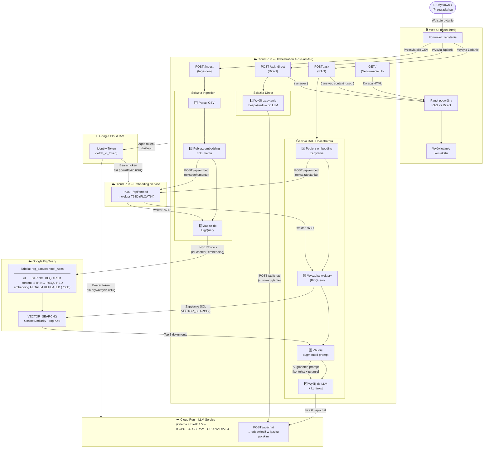
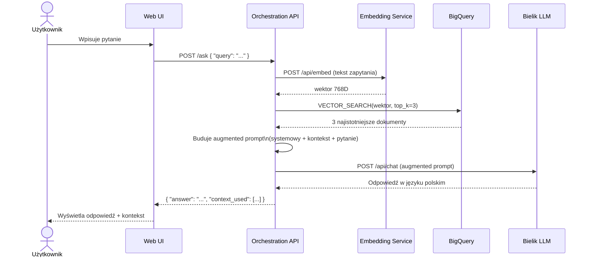
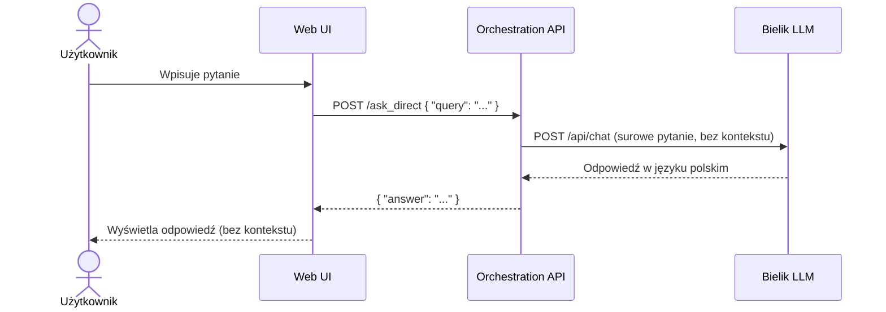
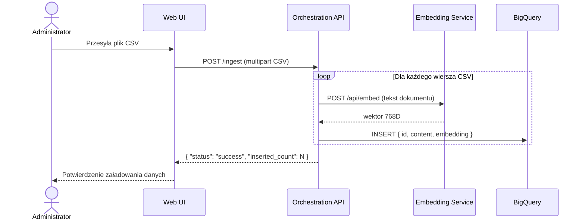
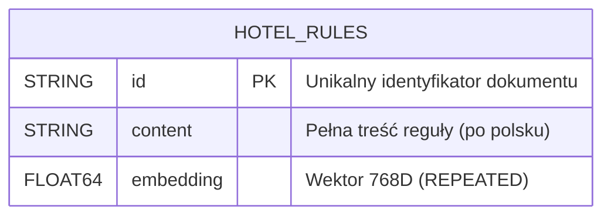
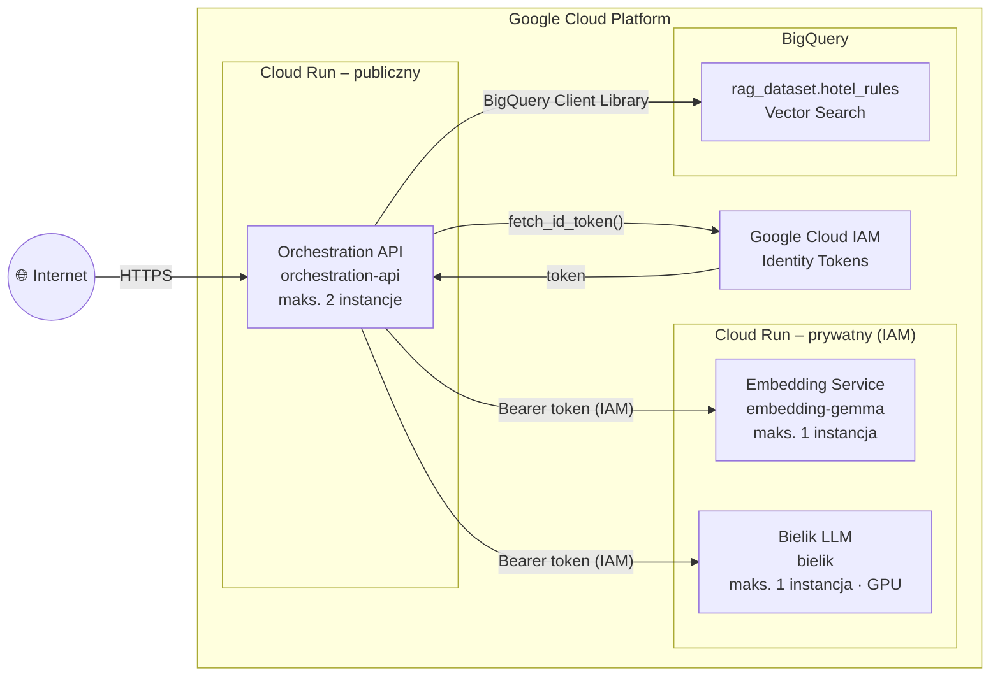

# Architektura Systemu – Eskadra Bielik Misja 2

System RAG (Retrieval-Augmented Generation) oparty na polskim modelu językowym Bielik,
uruchomiony na Google Cloud Platform.

---

## Diagram Komponentów i Przepływów Informacji

---

## Opis Komponentów

| Komponent | Technologia | Zasoby | Dostęp |
|---|---|---|---|
| **Web UI** | HTML5 + Vanilla JS + Marked.js | — | Publiczny |
| **Orchestration API** | FastAPI + Uvicorn (Python 3.11) | Cloud Run, maks. 2 instancje | Publiczny |
| **Embedding Service** | Ollama + EmbeddingGemma | 8 CPU, 16 GB RAM, maks. 1 instancja | Prywatny (IAM) |
| **LLM Service** | Ollama + Bielik 4.5b-v3.0-instruct Q8_0 | 8 CPU, 32 GB RAM, GPU NVIDIA L4, maks. 1 instancja | Prywatny (IAM) |
| **BigQuery Vector Store** | Google BigQuery + Vector Search | Zestaw danych: `rag_dataset`, tabela: `hotel_rules` | Prywatny (IAM) |

---

## Ścieżki Orkiestratora

### 1. Ścieżka RAG (POST /ask)

### 2. Ścieżka Direct (POST /ask_direct)

### 3. Ścieżka Ingestion (POST /ingest)

---

## Schemat Danych

---

## Topologia Wdrożenia (Google Cloud)

