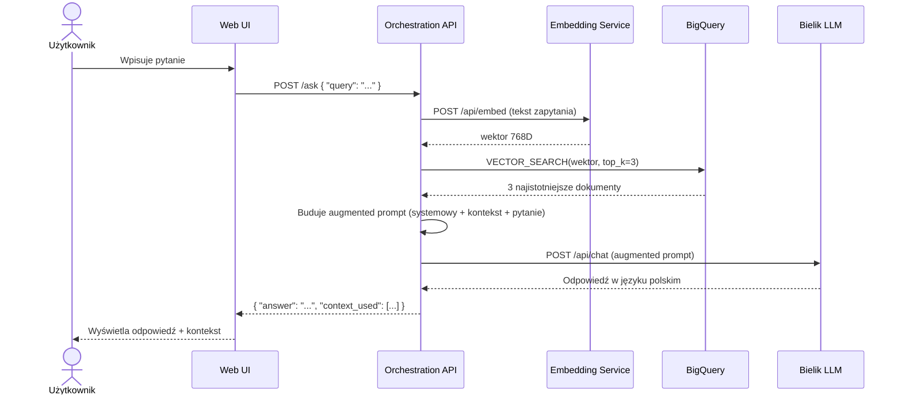
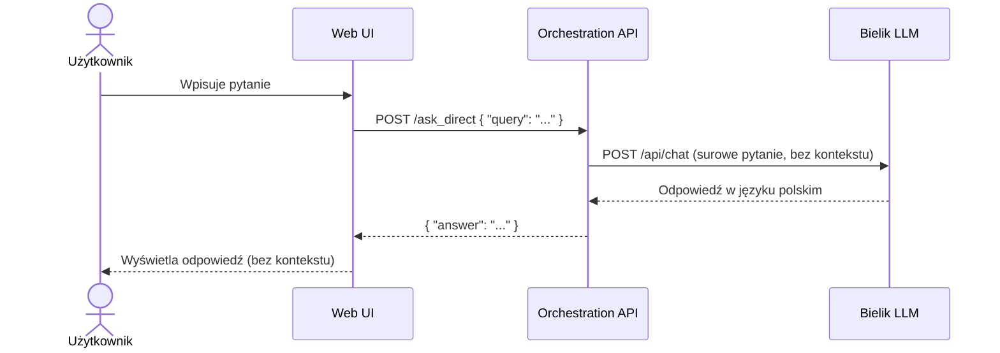

# Warsztaty – Eskadra Bielik Misja 2
## Prezentacja wprowadzająca – Koszalin

---

## SLAJD 1 – Tytuł

**Nagłówek:** ✈ ESKADRA BIELIK · Misja 2

**Tytuł główny:** RAG w oparciu o model Bielik i Google Cloud

**Podtytuł:** Suwerenne i wiarygodne AI – od dokumentów firmowych do inteligentnej bazy wiedzy

**Stopka:** Koszalin · Warsztaty stacjonarne · Powered by Google Cloud

---

## SLAJD 2 – Plan warsztatów (agenda)

**Nagłówek:** Plan warsztatów

**Lista kroków:**

1. Wprowadzenie – co budujemy i jak to działa?
2. Kluczowe pojęcia – embedding, baza wektorowa, RAG
3. Przygotowanie konta GCP i kredytów
4. Wdrożenie modelu Bielik (LLM) w Cloud Run
5. Wdrożenie modelu embeddingów w Cloud Run
6. Konfiguracja BigQuery Vector Search
7. Uruchomienie API Orchestration (FastAPI)
8. Załadowanie dokumentów do bazy wiedzy (ingestion)
9. Testowanie i demo – RAG vs Direct

---

## SLAJD 3 – Co budujemy?

**Nagłówek:** Co budujemy?

**Treść główna:**

Wdrożymy kompletny system **RAG** – inteligentnego asystenta, który zamiast gadać z głowy, odpowiada na pytania opierając się na **Twoich własnych dokumentach**.

**Trzy części systemu:**

- 🧠 **Model językowy Bielik** – rozumie pytania i generuje odpowiedzi po polsku
- 🔢 **Baza wektorowa BigQuery** – przechowuje i wyszukuje dokumenty semantycznie
- ⚙️ **Orchestration API** – łączy wszystko w całość i serwuje interfejs webowy

**Puenta:** Wszystko działa w chmurze Google Cloud, bezserwerowo – żadnych serwerów do zarządzania.

---

## SLAJD 4 – Co to jest Embedding?

**Nagłówek:** Co to jest embedding?

**Wstęp:**

Żeby komputer mógł *rozumieć* tekst – musi zamienić go na liczby. Embedding to właśnie ten proces.

**Analogia:**

> Wyobraź sobie, że każde słowo, zdanie czy dokument ma swój adres w przestrzeni wielowymiarowej.
> Bliskość adresów = podobieństwo znaczenia.

**Przykład:**

- „Pies gryzie list" i „Pies ugryzł listonosza" → adresy blisko siebie
- „Jutro pada deszcz" → adres zupełnie gdzie indziej

**W praktyce:**

Model EmbeddingGemma zamienia tekst na wektor 768 liczb. Te liczby trafiają do BigQuery. Kiedy użytkownik zadaje pytanie – jego pytanie też zamieniane jest na wektor, a BigQuery szuka wektorów *najbliższych* temu pytaniu.

**Kluczowe:** Wyszukiwanie jest **semantyczne** – nie po słowach kluczowych, ale po *znaczeniu*.

---

## SLAJD 5 – Co to jest baza wektorowa?

**Nagłówek:** Co to jest baza wektorowa?

**Wstęp:**

Zwykła baza danych szuka dokładnych dopasowań (np. `WHERE nazwa = 'Bielik'`).
Baza wektorowa szuka **podobieństw** – nawet jeśli pytanie jest sformułowane zupełnie inaczej niż dokument.

**Analogia:**

> Biblioteka, gdzie książki są ułożone nie alfabetycznie, ale według *treści*.
> Pytasz o „leczenie grypy" – i dostajesz też „metody na przeziębienie" i „domowe sposoby na infekcję".

**Jak to działa w BigQuery:**

1. Dokument → Model embeddingowy → Wektor (768 liczb) → Zapis w BigQuery
2. Pytanie → Model embeddingowy → Wektor → BigQuery szuka najbliższych wektorów
3. Znalezione fragmenty wracają do orchestratora jako *kontekst*

**Dlaczego BigQuery?**

BigQuery Vector Search skaluje się do milionów dokumentów bez zarządzania infrastrukturą. Tańsze i prostsze niż dedykowane bazy wektorowe.

---

## SLAJD 6 – Co to jest RAG?

**Nagłówek:** Co to jest RAG? · Retrieval-Augmented Generation

**Trzy kroki:**

**🔍 RETRIEVE – Wyszukaj**
Pytanie użytkownika zamieniane jest na wektor. BigQuery wyszukuje semantycznie pasujące fragmenty z dokumentów firmowych.

**➕ AUGMENT – Wzbogać**
Znalezione fragmenty doklejane są do pytania jako kontekst. Model dostaje nie tylko pytanie, ale też „ściągawkę" z bazy wiedzy.

**🤖 GENERATE – Odpowiedz**
Model Bielik generuje odpowiedź opierając się na dostarczonym kontekście – nie na tym, czego nauczył się podczas treningu.

**Dlaczego to ważne?**

Model językowy sam w sobie nie zna Twoich dokumentów, regulaminów ani wewnętrznych danych. RAG to sposób, żeby dać mu tę wiedzę *w locie*, bez ponownego trenowania.

---

## SLAJD 7 – Jak wygląda cały przepływ?

**Nagłówek:** Przepływ danych krok po kroku

**Krok po kroku (ścieżka RAG):**

1. Użytkownik wpisuje pytanie w **Web UI** (przeglądarka)
2. Pytanie trafia do **Orchestration API** (FastAPI, Cloud Run)
3. Orchestrator wysyła pytanie do **Embedding Service** → dostaje wektor 768D
4. Orchestrator odpytuje **BigQuery Vector Search** → dostaje N najbliższych fragmentów
5. Orchestrator buduje **augmented prompt**: pytanie + znalezione fragmenty
6. Augmented prompt trafia do **modelu Bielik** (Cloud Run + GPU)
7. Bielik generuje odpowiedź → wraca przez Orchestrator do **Web UI**
8. Użytkownik widzi odpowiedź **wraz z wyświetlonym kontekstem** (skąd wzięte)

**Ścieżka Direct (do porównania):**

Pytanie → Orchestrator → Bielik (bez kontekstu) → odpowiedź z głowy modelu

---

## SLAJD 8 – Ścieżka RAG – diagram sekwencji

**Nagłówek:** Ścieżka RAG krok po kroku · POST /ask



**Opis kroków dla slajdu (tekst pomocniczy):**

1. Użytkownik wpisuje pytanie w przeglądarce
2. Web UI wysyła `POST /ask` do Orchestration API
3. API zamienia pytanie na wektor 768D (Embedding Service)
4. API szuka 3 najbliższych fragmentów w BigQuery (Vector Search)
5. API skleja **augmented prompt**: system + kontekst + pytanie
6. Augmented prompt trafia do Bielika (LLM)
7. Bielik generuje odpowiedź po polsku
8. UI wyświetla odpowiedź **razem z użytym kontekstem**

---

## SLAJD 9 – Ścieżka Direct – diagram sekwencji

**Nagłówek:** Ścieżka Direct krok po kroku · POST /ask_direct



**Opis kroków dla slajdu (tekst pomocniczy):**

1. Użytkownik wpisuje pytanie w przeglądarce
2. Web UI wysyła `POST /ask_direct` do Orchestration API
3. API przekazuje pytanie **bezpośrednio** do Bielika – bez embeddingu, bez BigQuery
4. Bielik odpowiada tylko na podstawie swojej wiedzy treningowej
5. UI wyświetla odpowiedź – **bez dodatkowego kontekstu**

**Kluczowa różnica względem RAG:**
BigQuery i Embedding Service są całkowicie pominięte. Model operuje w próżni – odpowiada z głowy.

---

## SLAJD 10 – Architektura systemu

**Nagłówek:** Architektura systemu

**Komponenty:**

| Komponent | Technologia | Zasoby |
|---|---|---|
| Web UI | HTML/JS (statyczny) | serwowany przez FastAPI |
| Orchestration API | FastAPI · Python · Cloud Run | ~1 CPU · 2 GB RAM |
| Embedding Service | EmbeddingGemma · Ollama · Cloud Run | 8 CPU · 16 GB RAM |
| LLM Service | Bielik 4.5b · Ollama · Cloud Run | 8 CPU · 32 GB RAM · GPU NVIDIA L4 |
| Baza wektorowa | BigQuery + Vector Search | serverless |

**Kluczowe cechy:**

- W pełni bezserwerowy (serverless) – Cloud Run uruchamia się na żądanie
- Modele działają w kontenerach Docker na Ollama
- Wektorowa baza w BigQuery – skaluje się bez zarządzania infrastrukturą

---

## SLAJD 11 – Technologie, które poznamy

**Nagłówek:** Technologie, które poznamy

**Lista:**

- 🧠 **Bielik 4.5b** – suwerenny polski model językowy (SpeakLeash) – rozumie polski kontekst kulturowy
- 📦 **Ollama** – silnik do uruchamiania modeli LLM w kontenerze
- ☁️ **Google Cloud Run** – bezserwerowy hosting kontenerów (płacisz tylko za użycie)
- 🔢 **EmbeddingGemma** – model zamieniający tekst na wektory (Google DeepMind)
- 🗄️ **BigQuery + Vector Search** – hurtownia danych z wyszukiwaniem semantycznym
- ⚡ **FastAPI** – szybki Python REST API spinający cały system
- 🐚 **Cloud Shell** – terminal w przeglądarce, bezpłatny, wbudowany w GCP

---

## SLAJD 12 – RAG vs Direct – co testujemy?

**Nagłówek:** RAG vs Direct – co będziemy porównywać?

**Direct (model bez kontekstu):**
- Odpowiada tylko z wiedzy zdobytej podczas treningu
- Nie zna Twoich dokumentów
- Może halucynować – wymyślać fakty z przekonaniem
- Szybki, prosty, nie wymaga infrastruktury

**RAG (model z bazą wiedzy):**
- Odpowiada na podstawie Twoich dokumentów
- Wyświetla kontekst – skąd pochodzi odpowiedź
- Znacznie mniej halucynacji
- Wiedza aktualna i specyficzna dla Twojej organizacji

**W Web UI** obie odpowiedzi wyświetlają się obok siebie – zobaczysz różnicę na własne oczy.

---

## SLAJD 13 – Czego potrzebujesz?

**Nagłówek:** Zanim zaczniemy – czego potrzebujesz?

**Lista wymagań:**

- 💻 **Laptop z przeglądarką** – Chrome lub Firefox (najnowsza wersja)
- 📧 **Konto Gmail** – musi być `@gmail.com` (nie firmowe, nie Google Workspace!)
- ☁️ **Konto Google Cloud** – jeśli nie masz, założymy razem
- 🐙 **Konto GitHub** – do sklonowania repozytorium
- 🌐 **Dostęp do internetu** – WiFi zapewniony przez organizatora

**Uwaga do konta Gmail:**
Kredyty GCP wymagają konta osobistego Gmail. Konta Google Workspace (firmowe, szkolne) **nie kwalifikują się** do programu kredytowego.

---

## SLAJD 14 – Kredyty Google Cloud

**Nagłówek:** 💰 Kredyty Google Cloud – $10 na start

**Sponsor:** Google Cloud sponsoruje ten event – każdy uczestnik otrzymuje $10 kredytów.

**Link do kredytów:**
`[WSTAW LINK TUTAJ]`

**QR Kod:** `[WSTAW QR KOD]`

**Instrukcja krok po kroku:**

1. Otwórz link powyżej (lub zeskanuj QR kod)
2. Zaloguj się kontem **@gmail.com** (NIE firmowym!)
3. Utwórz **nowy projekt** w Google Cloud Console
4. Kredyty zostaną automatycznie przypisane do projektu
5. Sprawdź: Billing → Credits

**⚠️ Ważne:**
- Konto MUSI być `@gmail.com` – nie Google Workspace, nie konto firmowe
- Kredyty działają tylko z nowym projektem / nowym billing account
- Każda osoba ma własny link – nie udostępniaj

---

## SLAJD 15 – Repozytorium z kodem

**Nagłówek:** 🐙 Repozytorium z kodem

**Adres:**
`github.com/avedave/eskadra-bielik-misja2`

**Klonowanie w Cloud Shell:**

```bash
git clone https://github.com/avedave/eskadra-bielik-misja2
cd eskadra-bielik-misja2
cloudshell workspace .
```

**Jak otworzyć Cloud Shell:**
Google Cloud Console (console.cloud.google.com) → ikona `>_` w górnym pasku narzędzi

**Tip:** Cloud Shell to bezpłatny terminal w przeglądarce z Gmailowych kont GCP. Ma już zainstalowane `gcloud`, `git`, Docker i inne narzędzia.

---

## SLAJD 16 – Zaczynamy!

**Nagłówek:** ✈️ Zaczynamy!

**Treść:**
Eskadra Bielik – Misja 2 · Koszalin

**Podtytuł:** Pytania? Śmiało – jesteśmy tu po to!
